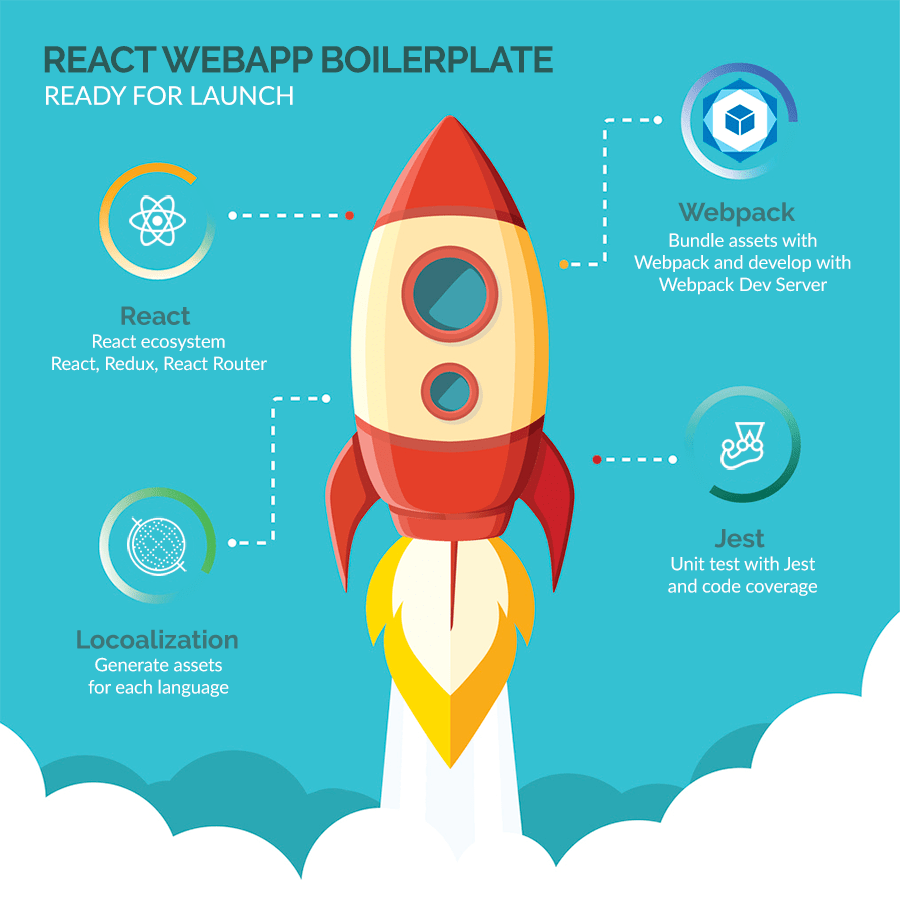

# React Webapp Boilerplate

[](https://david-dm.org/jeantimex/react-webapp-boilerplate)
[](https://david-dm.org/jeantimex/react-webapp-boilerplate?type=dev)
[](https://travis-ci.org/jeantimex/react-webapp-boilerplate)
[](https://coveralls.io/github/jeantimex/react-webapp-boilerplate)

<br />

## Features

**Quick scaffolding**<br />
Save your time in putting React, Redux, Router, Webpack, Jest and localization together, so you can focus on coding your awesome project.

**Basic react eco system**<br />
The scaffolded project will include the latest React, Redux, React Router and React Intl.

**Webpack 3**<br />
Enjoy the tree shaking feature in Webpack 3.

**Jest**<br />
Facebook's painless JavaScript test runner, no need to configure Karma Webpack, no need to use Sinon and Babel Rewire.

## Quick start

**Get up and running**<br />
1. Clone this repo using `git clone https://github.com/jeantimex/react-webapp-boilerplate.git`
2. Run `yarn` or `npm install` to install the dependencies
3. Run `yarn run dev` or `npm run dev` to see the example app at `http://localhost:3000`

**Unit testing**<br />
Unit testing is powered by **Jest**, run `yarn run test` or `npm run test` and the results will be printed:
```
 PASS  tests/pages/todos/Todos.spec.js
 PASS  tests/pages/about/About.spec.js
 PASS  tests/reducers/TodoReducer.spec.js
 PASS  tests/actions/index.spec.js
-----------------|----------|----------|----------|----------|----------------|
File             |  % Stmts | % Branch |  % Funcs |  % Lines |Uncovered Lines |
-----------------|----------|----------|----------|----------|----------------|
All files        |      100 |      100 |      100 |      100 |                |
 pages/about     |      100 |      100 |      100 |      100 |                |
  About.js       |      100 |      100 |      100 |      100 |                |
 pages/home      |      100 |      100 |      100 |      100 |                |
  Home.js        |      100 |      100 |      100 |      100 |                |
 pages/todos     |      100 |      100 |      100 |      100 |                |
  Todos.js       |      100 |      100 |      100 |      100 |                |
 reducers        |      100 |      100 |      100 |      100 |                |
  TodoReducer.js |      100 |      100 |      100 |      100 |                |
-----------------|----------|----------|----------|----------|----------------|
```

**Localization**<br />
This demo supports two locales: `en-US` and `zh-CN`, you can add other locales for your application. By default, `en-US` is used, to choose a different locale for development and final build, simply specify the `LOCALE` node environment to your locale, for example:

- `LOCALE=zh-CN yarn run dev` or `LOCALE=zh-CN npm run dev`: Running example app in Chinese language.
- `LOCALE=zh-CN yarn run build` or `LOCALE=zh-CN npm run build`: Build the dist for Chinese language.
- `yarn run release` or `npm run release`: Bundle the assets for all supported locales that are defined in `app/locales` folder.

## License

MIT License

Copyright (c) 2017 Yong Su @jeantimex

Permission is hereby granted, free of charge, to any person obtaining a copy
of this software and associated documentation files (the "Software"), to deal
in the Software without restriction, including without limitation the rights
to use, copy, modify, merge, publish, distribute, sublicense, and/or sell
copies of the Software, and to permit persons to whom the Software is
furnished to do so, subject to the following conditions:

The above copyright notice and this permission notice shall be included in all
copies or substantial portions of the Software.

THE SOFTWARE IS PROVIDED "AS IS", WITHOUT WARRANTY OF ANY KIND, EXPRESS OR
IMPLIED, INCLUDING BUT NOT LIMITED TO THE WARRANTIES OF MERCHANTABILITY,
FITNESS FOR A PARTICULAR PURPOSE AND NONINFRINGEMENT. IN NO EVENT SHALL THE
AUTHORS OR COPYRIGHT HOLDERS BE LIABLE FOR ANY CLAIM, DAMAGES OR OTHER
LIABILITY, WHETHER IN AN ACTION OF CONTRACT, TORT OR OTHERWISE, ARISING FROM,
OUT OF OR IN CONNECTION WITH THE SOFTWARE OR THE USE OR OTHER DEALINGS IN THE
SOFTWARE.
